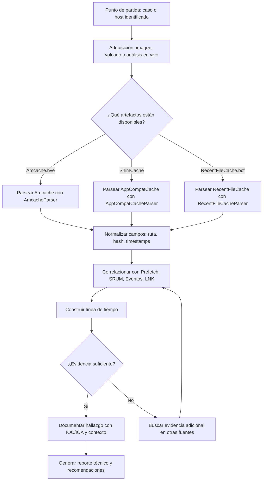

Fuentes de Datos: Windows - Registros de Ejecución:

## 🧩 Artefactos de Ejecución en Windows

<sub>Fuentes clave para reconstruir qué se ejecutó en el sistema. Incluyo descripción, uso típico y herramientas recomendadas.</sub>

<table>
  <thead>
    <tr>
      <th>🗂️ Artefacto</th>
      <th>📝 Descripción</th>
      <th>🛠️ Herramientas</th>
      <th>🔗 Enlaces</th>
    </tr>
  </thead>
  <tbody>
    <tr>
      <td><strong>Amcache</strong></td>
      <td>
        Base de datos creada por Windows (Programa de compatibilidad) que registra programas ejecutados/instalados, rutas, hashes y metadatos. Útil para determinar <em>primera/última</em> ejecución y presencia histórica.
        <br/><strong>Ubicación típica:</strong> <code>C:\Windows\AppCompat\Programs\Amcache.hve</code>
      </td>
      <td>
        • AmcacheParser (EZ)<br/>
        • AmcacheParser (Python)
      </td>
      <td>
        <a href="https://ericzimmerman.github.io/#!index.md">🔗 AmcacheParser (Eric Zimmerman)</a><br/>
        <a href="https://github.com/williballenthin/python-amcache">🔗 python-amcache (W. Ballenthin)</a>
      </td>
    </tr>
    <tr>
      <td><strong>ShimCache / AppCompatCache</strong></td>
      <td>
        Caché de compatibilidad en el hive <code>SYSTEM</code> que lista ejecutables vistos por el sistema (aunque ya no existan). No siempre indica ejecución <em>exitosa</em>, pero es excelente para presencia temporal y rutas.
        <br/><strong>Ubicación típica:</strong> <code>HKLM\SYSTEM\CurrentControlSet\Control\Session Manager\AppCompatCache</code>
      </td>
      <td>
        • AppCompatCacheParser (EZ)<br/>
        • ShimCacheParser (Python)
      </td>
      <td>
        <a href="https://ericzimmerman.github.io/#!index.md">🔗 AppCompatCacheParser (Eric Zimmerman)</a><br/>
        <a href="https://github.com/mandiant/ShimCacheParser">🔗 ShimCacheParser (Mandiant)</a>
      </td>
    </tr>
    <tr>
      <td><strong>RecentFileCache.bcf</strong></td>
      <td>
        Referencias a ejecutables usados por subsistemas de compatibilidad (Win7/Win8 principalmente). Útil para ver software recientemente observado por el sistema en escenarios legacy.
        <br/><strong>Ubicación típica:</strong> <code>C:\Windows\AppCompat\Programs\RecentFileCache.bcf</code>
      </td>
      <td>
        • RecentFileCacheParser (Python)<br/>
        • WindowsSCOPE (viewer)
      </td>
      <td>
        <a href="https://github.com/keydet89/Tools/blob/master/RecentFileCacheParser.py">🔗 RecentFileCacheParser (Corey Harrell)</a><br/>
        <a href="https://www.windowsscope.com/">🔗 WindowsSCOPE</a>
      </td>
    </tr>
  </tbody>
</table>

> 🧠 **Consejo rápido:** Corrobora con múltiples fuentes (Prefetch, SRUM, Timeline, Eventos 4688/592, LNK) para elevar la confianza del hallazgo.

---

## Flujo sugerido de análisis (Mermaid)



# 🖥️ Uso de Sysmon (System Monitor)

**Sysmon** (*System Monitor*) es una herramienta gratuita de Microsoft (parte de **Sysinternals**) que registra en el *Event Log* de Windows actividades de bajo nivel como creación de procesos, conexiones de red, cambios en el registro y carga de controladores.  
Se usa principalmente en **DFIR** (*Digital Forensics and Incident Response*), **threat hunting** y **detección de intrusiones**.

---

## 1️⃣ ¿Para qué sirve Sysmon?
Sysmon **no** reemplaza un antivirus, es un *sensor* que extiende el registro de eventos de Windows.  
Permite:
- Monitorear **creación/terminación de procesos** con detalles como hash y línea de comandos.
- Registrar **conexiones de red** con IP origen/destino y puertos.
- Detectar **modificaciones de ficheros** sospechosos.
- Rastrear **inyección de código** y carga de controladores.
- Facilitar la correlación de eventos en **SIEMs** como Splunk, ELK o Microsoft Sentinel.

---

## 2️⃣ Instalación
1. Descargar Sysmon desde la página oficial:  
   🔗 [Sysmon - Sysinternals](https://learn.microsoft.com/en-us/sysinternals/downloads/sysmon)
2. Extraer el ZIP en una carpeta (por ejemplo: `C:\Tools\Sysmon`).
3. Ejecutar en una consola **PowerShell como administrador**:
   ```powershell
   sysmon64.exe -accepteula -i

## 3️⃣ Configuración recomendada

Por defecto, Sysmon genera mucho ruido.  
Se recomienda usar un archivo **XML** que defina qué eventos y filtros aplicar.

**Configuración popular y mantenida:**  
🔗 [Sysmon Config - SwiftOnSecurity](https://github.com/SwiftOnSecurity/sysmon-config)

**Instalar con configuración personalizada:**
```powershell
sysmon64.exe -accepteula -i sysmonconfig.xml
```

## 4️⃣ Ubicación de los logs

Sysmon guarda los eventos en el Visor de eventos de Windows:

Applications and Services Logs > Microsoft > Windows > Sysmon > Operational


También puedes verlos desde PowerShell:

Get-WinEvent -LogName "Microsoft-Windows-Sysmon/Operational"

## 5️⃣ Eventos clave para hunting

| Event ID | Descripción               | Uso común en hunting                    |
|----------|---------------------------|------------------------------------------|
| 1        | Creación de proceso       | Detectar LOLBins, PowerShell sospechoso  |
| 3        | Conexión de red           | Salidas a IP maliciosa, C2               |
| 7        | Carga de imagen/DLL       | Inyecciones, librerías raras             |
| 8        | Creación de hilo remoto   | Técnicas de inyección                    |
| 11       | Creación de archivo       | Drop de malware                          |
| 13       | Modificación del Registro | Persistencia                             |
| 22       | DNS Query                 | Detección de DGA, exfiltración           |

## 6️⃣ Buenas prácticas

Usar whitelist y filtros para reducir el ruido.

Enviar logs a un SIEM para correlación y retención prolongada.

Actualizar la configuración periódicamente con nuevas TTPs.

Mapear eventos a MITRE ATT&CK para análisis estructurado.

Evitar el modo verbose en equipos con poco almacenamiento.

## 7️⃣ Actualización o desinstalación

Actualizar configuración sin reinstalar:
```powershell
sysmon64.exe -c sysmonconfig.xml
```

Desinstalar Sysmon:
```powershell
sysmon64.exe -u
```
